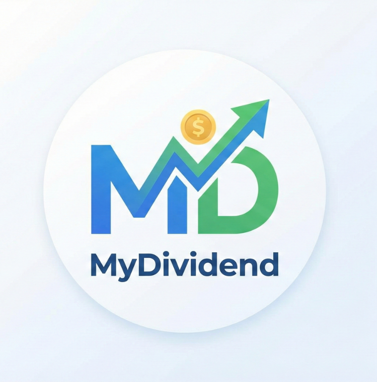
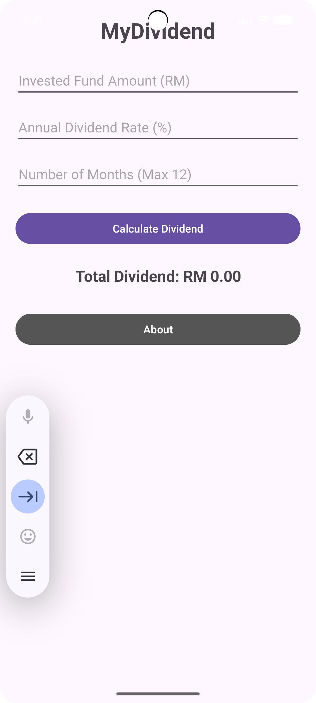
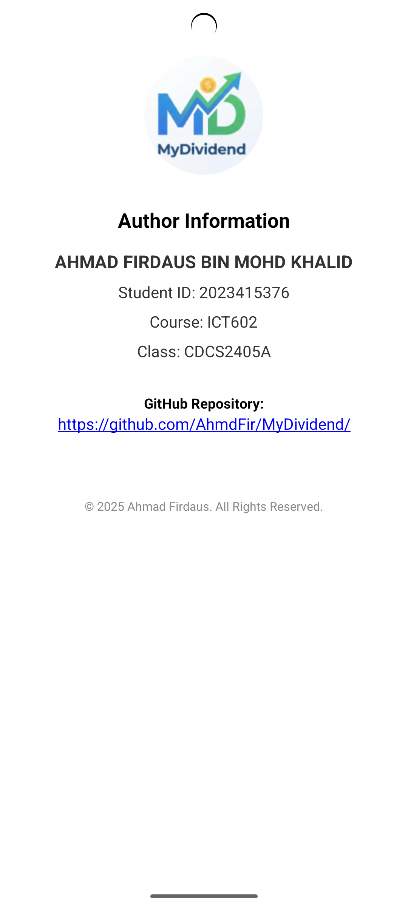

# MyDividend

## 📖 About the Application
**MyDividend** is a native Android mobile application designed to help investors calculate the potential returns on their unit trust investments. This app was developed as an individual assignment for the **ICT602 (Mobile Technology and Development)** course.

It provides a simple, user-friendly interface to input investment details and automatically computes the total dividend yield based on monthly calculations, ensuring precise financial planning for users.

## 👨‍🎓 Student Information
* **Name:** AHMAD FIRDAUS BIN MOHD KHALID
* **Student ID:** 2023415376
* **Course:** ICT602 - Mobile Technology and Development
* **Class:** CDCS2405A
* **Faculty:** College of Computing, Informatics and Media

## ✨ Features
This application meets the following assignment requirements:

* **Input Capability:**
  * Accepts **Invested Fund Amount** (RM).
  * Accepts **Annual Dividend Rate** (%).
  * Accepts **Number of Months Invested** (with validation to ensure a maximum of 12 months).
* **Smart Calculation:**
  * Calculates **Monthly Dividend** using the formula: `(Rate / 12) * Invested Fund`.
  * Calculates **Total Dividend** using the formula: `Monthly Dividend * Number of Months`.
* **Clear Output:**
  * Displays the final result formatted clearly to **two decimal places** (e.g., RM 2500.00).
* **Navigation & UI:**
  * Features a responsive "Mobile First" design.
  * Includes a navigation menu (Home & About).
  * **About Page** contains the app icon, author details, copyright notice, and a clickable link to this GitHub repository.

## 📸 App Screenshots

| Home Screen | Calculation Result | About Page |
|:---:|:---:|:---:|
|  |  |  |

## 📱 Application Requirements
To successfully install and run this application, your device must meet the following specifications:

* **Operating System:** Android 7.0 (Nougat) or higher (API Level 24+).
* **Device Type:** Compatible with Android Smartphones and Tablets.
* **Storage Space:** Approximately 10MB of free space.
* **Orientation:** Optimized for Portrait mode.

### Installation Guide (APK)
1.  Download the `.apk` file from the releases section (or build output).
2.  Enable "Install from Unknown Sources" in your device settings if required.
3.  Open the file and tap **Install**.
4.  Launch **MyDividend** from your app drawer.

---
© 2025 Ahmad Firdaus. All Rights Reserved.